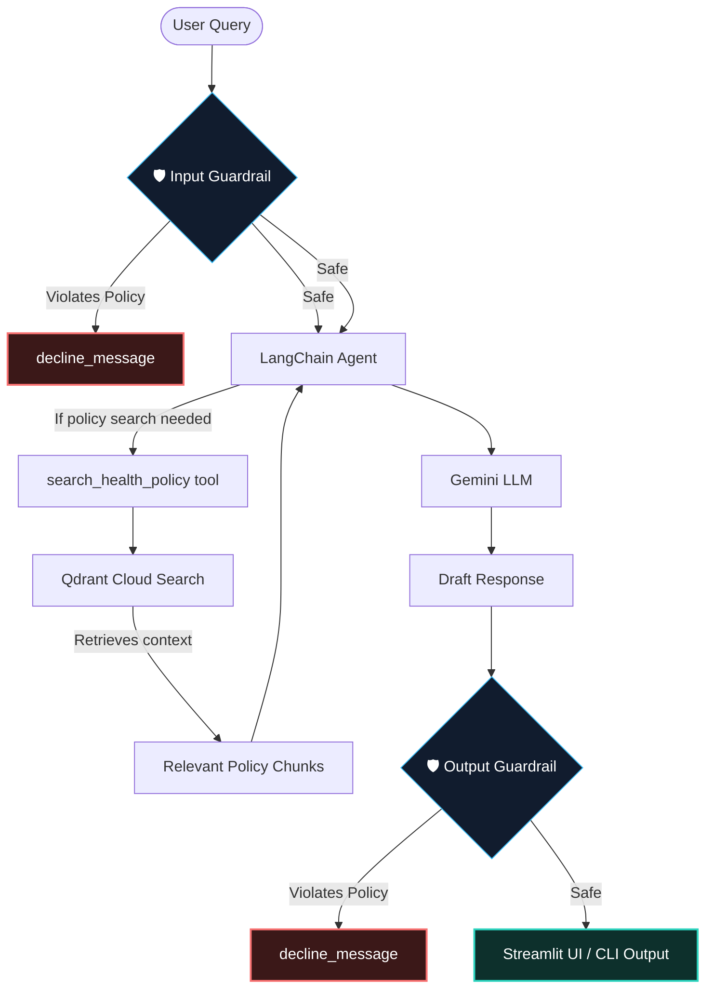

# 🛡️ HealthShield AI — Agentic RAG Health Insurance Assistant

> **An enterprise-grade, agentic RAG assistant for health insurance policies powered by LangChain, Qdrant vector search, Jina Embeddings, and Google Gemini. Features bidirectional LLM safety guardrails to defend against prompt injections and hallucinations.**

---

## 🌌 Overview

**HealthShield AI** is a production-ready, highly secure Retrieval-Augmented Generation (RAG) agent that parses, indexes, and reasons over complex health insurance policy documents. 

By leveraging **agentic tool-calling**, the assistant dynamically searches the policy document to provide highly accurate, contextual answers. To ensure safety and regulatory compliance in the health domain, HealthShield AI implements a **dual-shield guardrail pipeline** that audits both incoming queries (for prompt injections/jailbreaks) and outgoing answers (to block unauthorized medical diagnoses or hallucinated policy claims).

---

## 🛠️ System Architecture



## ✨ Features

- **🤖 Tool-Calling Agent:** Built with LangChain's native tool-calling architecture, enabling the agent to decide *when* and *how* to query the insurance document.
- **🛡️ Bidirectional Guardrails:** Dual Groq-hosted safety models running `openai/gpt-oss-safeguard-20b` for JSON-structured auditing:
  - **Input Shield:** Detects jailbreaks (Base64 encoding, ROT13, roleplay like "DAN") and system configuration extraction attempts.
  - **Output Shield:** Validates the assistant's answer to block unauthorized medical diagnoses, absolute financial/claims guarantees, and prompt leakages.
- **⚡ Hybrid Vector Database:** Integrates **Qdrant Cloud** and **Jina Embeddings v5 (`jina-embeddings-v5-omni-small`)** for highly dense semantic matching.
- **🎨 Glassmorphic Streamlit Dashboard:** A premium, modern front-end featuring:
  - Interactive policy readiness console.
  - Dynamic source citation expanders displaying raw text and page numbers.
  - Performance tracking (exact query-to-answer elapsed time).
  - Built-in feedback (Thumbs up/down) and a markdown conversation exporter.

---

## 📁 Project Structure

```bash
├── data/
│   └── policy_file.pdf       # The target health insurance policy PDF
├── policy_assistant/
│   ├── __init__.py
│   ├── agent.py              # LangChain tool-calling agent initializer
│   ├── chunking.py           # Recursive text splitter logic
│   ├── config.py             # System variables, paths, and model specs
│   ├── docs_loader.py        # PDF document ingestion pipeline
│   ├── embeddings.py         # Jina v5 embedding integration
│   ├── guardrails.py         # Dual-shield safety checks (Input & Output)
│   ├── llm.py                # Google Gemini interface
│   ├── logger.py             # Standardized application logging
│   ├── pipeline.py           # Core RAG workflow orchestrator
│   └── tools.py              # Tool wrappers (search_health_policy)
├── app.py                    # Streamlit web application
├── main.py                   # Command-line interface demo
├── pyproject.toml            # Python packaging and metadata
├── requirements.txt          # Python dependencies
├── uv.lock                   # Lockfile for reproducible installs
└── .env.example              # Template environment file
```

---

## ✨ Features

- **🤖 Tool-Calling Agent:** Powered by LangChain's native tool-calling architecture, allowing the model to autonomously determine when and how to retrieve policy context.
- **🛡️ Bidirectional Guardrails:** Dual Groq-hosted safety models (`openai/gpt-oss-safeguard-20b`) running JSON-structured auditing:
  - **Input Shield:** Intercepts jailbreak vectors (Base64 encoding, ROT13, "DAN"-style roleplay) and configuration extraction attempts.
  - **Output Shield:** Validates model answers to prevent unauthorized medical diagnoses, absolute claim/financial guarantees, and system prompt leakages.
- **⚡ High-Density Semantic Vector DB:** Combines **Qdrant Cloud** with **Jina Embeddings v5** (`jina-embeddings-v5-omni-small`) for dense, accurate semantic matching across policy clauses.
- **🎨 Glassmorphic Streamlit Dashboard:**
  - Interactive policy readiness & status console.
  - Dynamic source citation expanders displaying raw text and exact page references.
  - Real-time performance tracking (query-to-response latency).
  - Built-in user feedback (thumbs up/down) and a Markdown conversation export tool.

---

## 📊 Technical Stack

| Component | Technology |
| :--- | :--- |
| **Orchestration** | [LangChain](https://www.langChain.com/) |
| **Primary LLM** | Google Gemini |
| **Vector Database** | [Qdrant Cloud](https://qdrant.tech/) |
| **Embedding Model** | Jina AI v5 (`jina-embeddings-v5-omni-small`) |
| **Guardrail Safety Host** | Groq Cloud (`openai/gpt-oss-safeguard-20b`) |
| **Frontend UI** | [Streamlit](https://streamlit.io/) |
| **Environment & Package Mgmt** | Python 3.12+ / `uv` / `pip` |

---

## 🛡️ Trust & Safety Specifications

HealthShield AI implements strict validation pipelines before any query touches the database and before any final answer is returned to the user:

| Guardrail Phase | Targeted Risk | Mitigation / Action |
| :--- | :--- | :--- |
| **Input Audit** | Jailbreaks, prompt injections, extraction attempts | Automatically halts execution and returns: *"Sorry, I can't help with that request."* |
| **Grounding Audit** | Hallucinations, unsourced claim approvals | Constrains answers strictly to verified context chunks retrieved from Qdrant. |
| **Advice Audit** | Unauthorized medical diagnoses, prescription suggestions | Blocks medical prescribing; advises the user to consult a licensed medical professional. |
| **Transparency Audit** | System prompt leakage | Blocks responses exposing internal variables, tool definitions, or developer prompts. |

---
## ⚡ Quick Start

### 1. Clone the Repository

```bash
git clone https://github.com/Abhiram-100/HealthShield-AI---Agentic-RAG-Health-Insurance-Policy-Assistant.git
cd HealthShield-AI---Agentic-RAG-Health-Insurance-Policy-Assistant
```

### 2. Install Dependencies

Ensure you have Python >= 3.12 installed.

**Using uv (Recommended):**
```bash
uv sync
```

**Using standard pip:**
```bash
python -m venv .venv
source .venv/bin/activate  # On Windows: .venv\Scripts\activate
pip install -r requirements.txt
```

### 3. Configure Environment Variables

Copy `.env.example` to a new `.env` file:
```bash
cp .env.example .env
```

Fill in your credentials inside `.env`:
```env
GOOGLE_API_KEY="your-gemini-api-key"
JINA_API_KEY="your-jina-embeddings-api-key"
GROQ_API_KEY="your-groq-api-key"

# Qdrant Vector Cloud Setup
QDRANT_URL="https://your-qdrant-cluster.aws.qdrant.io"
QDRANT_API_KEY="your-qdrant-api-key"
```

---

## 🚀 Usage

### Run the Web Dashboard (Streamlit)

Launch the UI to interact with the assistant, see source citations, and check system logs:
```bash
streamlit run app.py
```

### Run the CLI Demo

Verify the pipeline works correctly with a CLI-based question prompt:
```bash
python main.py
```

---
